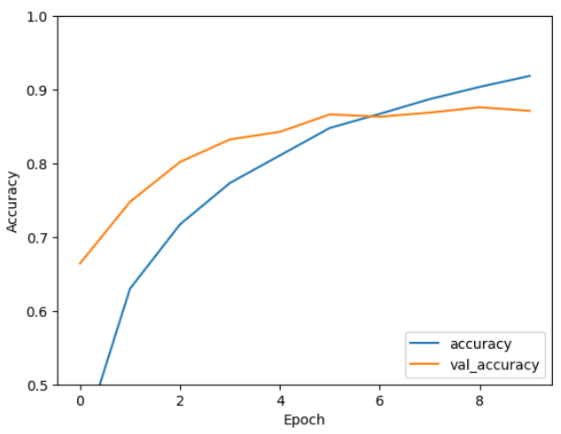

# Urban Sound Classification
### Data
> All data have been obtained from [UrbanSound8K dataset](https://urbansounddataset.weebly.com/urbansound8k.html).

### Preprocessing
> The audio files were first converted into spectrograms.
> Then, these spectrograms were transformed into images.
> These images were converted to grayscale and resized to 128x128 pixels.

### Model Architecture
> The model design is based on the simple CNN model found on the [TensorFlow tutorial for image CNNs](https://www.tensorflow.org/tutorials/images/cnn?hl=en).

  
### Training Steps

  
### Model Results

